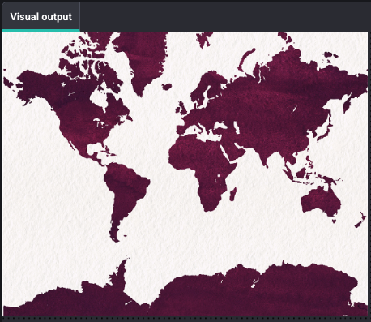

<h2 class="c-project-heading--task">Show the world map</h2>

<h2 class="c-project-heading--explainer">In this project you will make an interactive map that lets users see the happiness measures of different countries.</h2>

--- task ---

Start by showing a map.

--- /task ---

Create a global variable called 'map' and set it to load the old_map.jpg image.

Then set the canvas size in the `setup()` function.

--- code ---
---
language: python
filename: main.py
line_numbers: true
line_number_start: 7
line_highlights: 9,10,14
---
# Put code to run once here
def preload():
    global map
    map = load_image("old_map.jpg")

def setup():
    size(991, 768)
--- /code ---

### Tip

- The canvas size is **991** pixels by **768** pixels.

