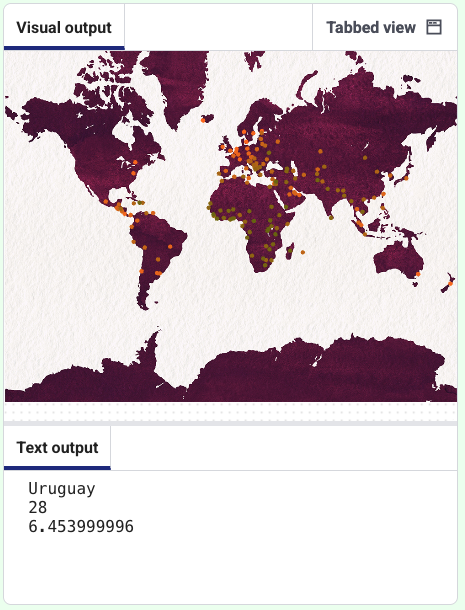

<h2 class="c-project-heading--task">Click to see the region's data</h2>

When the user clicks on a pin, the hex colour value of the pin is retrieved, and then the corresponding region is found in the dictionary.

In your `mouse_pressed()` function, lookup the `pixel_colour` in the `colours` dictionary and print out the `region`.

--- code ---
---
language: python
filename: main.py
line_numbers: true
line_number_start: 62
line_highlights: 64-70
---
def mouse_pressed():
    pixel_colour = Color(get(mouse_x, mouse_y)).hex
    if pixel_colour in colours:
        facts = colours[pixel_colour]
        print(facts['name'])
        print(facts['happiness rank'])
        print(facts['happiness score'])
    else:
        print('Region not detected')
--- /code ---

## Now run your code

Click on a pin to see the data for that region.

